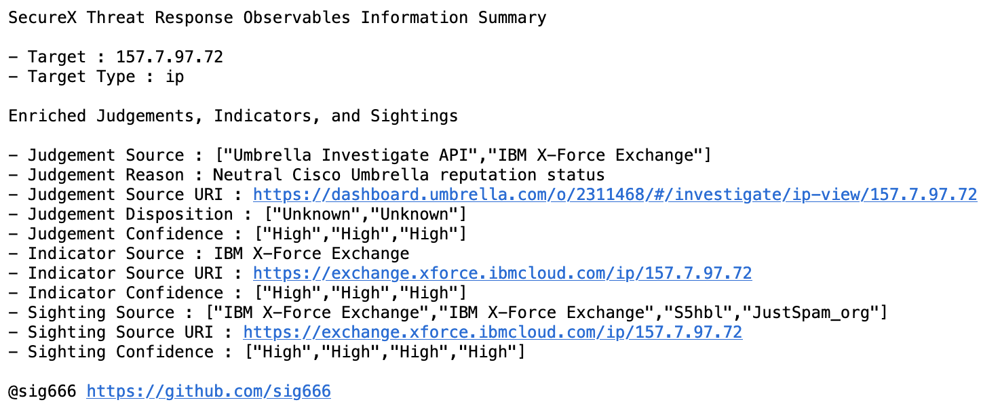
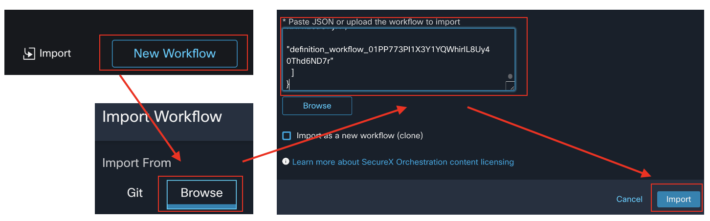

# SecureX-Workflow-ThreatResponse-QuickSearchToCasebook
This workflow is a simple example of reporting on a searchable IoC using the SecureX Threat Response Enrich Observables API by enriching some additional information from the Threat Inteligences which are integrated with SecureX backend. The workflow will create reports of summary information related to Judgments, Indicators, and Sightings that can be responded to by Threat Inteligence for Observable Types supported by SecureX Threat Response API Endpoint /iroh/iroh-enrich/observe/observables Endpoint. The summary reported will be created as New SecureX Casebook and sent to the specified email address.

# Change Log
- Dec, 18, 2022 : Initial Release

# Requirements
The following system atomics are used by this workflow:
- Threat Response - Generate Access Token
- Threat Response - Enrich Observable
- Threat Response - Create Casebook
- Set Variables
- JSONPath Query
- Send Email

The following atomic actions must be imported before you can import this workflow:
- None

The targets and account keys listed at the bottom of the page
- Threat Response

# Workflow Steps
1. Generate a Token for the Threat Response API
2. Store the Threat Response Access Token to Local Text
3. Request Threat Response API Enriching Observable information for specified IoC and IoC Types
4. Parse the Query Response and generate report message template
5. Create Threat Response Casebook
6. Send Report to Email

# Installation
1. Browse to your SecureX orchestration instance. This wille be a different URL depending on the region your account is in:
 - US: https://securex-ao.us.security.cisco.com/orch-ui/workflows/
 - EU: https://securex-ao.eu.security.cisco.com/orch-ui/workflows/
 - APJC: https://securex-ao.apjc.security.cisco.com/orch-ui/workflows/
2. Click on **Import** to import the workflow.
3. Select **Browse** from Import From
4. Open **SecureX-Workflow-Umbrella-EventReportToCasebook.json** and Copy text
5. Paste to **Paste JSON or upload the workflow to import** and click **Import**

# Configuration
- Set the Variable of `Target`, `Overrride workflow target` in `Send Email` - ex: Email Endpoint
- Set the Variable of `Email From` in `Send Email` - ex: xxx@cisco.com
- Set the Variable of `Email To` in `Send Email` - ex: xxx@companey.info

# Targets
Target Group: `Default TargetGroup`

By default, the Default TargetGroup may not include SMTP Endpoint targets. If this is the case, you will need to update the target group and add SMTP Endpoint to the target types included. More information about target groups can be found here https://ciscosecurity.github.io/sxo-05-security-workflows/targets/groups.

# Account Keys
Default
